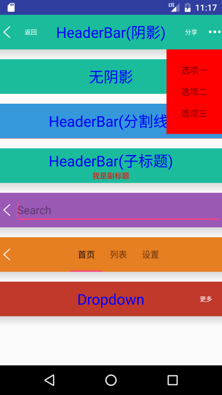

[](https://bintray.com/openproject/maven/lesscode-headerbar)

# LessCode-HeaderBar
a common header bar ui for android



## Gradle

```groovy
compile('com.jayfeng:lesscode-lesscode:1.0');
```

## Overview
> * 支持常见状态栏效果
> * 支持副标题
> * 支持阴影
> * 支持搜索
> * 支持弹窗
> * 使用非常简单

## Usage
配置如下，
```java
HeaderBarConfig.getInstance()
    // header
    .headerHeight(DisplayLess.$dp2px(56))
    .headerBackgroundDrawable(new ColorDrawable(Color.parseColor("#1abc9c")))
    .headerBackIcon(R.drawable.app_back)
    .headerShadowDrawable(getResources().getDrawable(R.drawable.app_shadow))
    .headerShadowHeight(DisplayLess.$dp2px(16))
    // title
    .titleTextColor(Color.BLUE)
    .titleTextSize(24)
    .subtitleTextColor(Color.RED)
    // item
    .itemTextNormalColor(getResources().getColor(R.color.header_menu_text_normal_color))
    .itemTextPressedColor(getResources().getColor(R.color.header_menu_text_pressed_color))
    .itemTextSize(10)
    .itemBackgroudResource(R.drawable.app_item_bg_transparent)
    .build();
```
布局中定义HeaderBar,
```xml
<com.jayfeng.lesscode.headerbar.HeaderBar
    android:id="@+id/headerbar"
    android:layout_width="match_parent"
    android:layout_height="wrap_content" />
```
除了全局配置之外，也可以为每个HeaderBar直接设置一些属性值，
```xml
<declare-styleable name="HeaderBar">
    <attr name="hb_title_text_color" format="color" />
    <attr name="hb_title_text_size" format="dimension" />
    <attr name="hb_subtitle_text_color" format="color" />
    <attr name="hb_subtitle_text_size" format="dimension" />
    <attr name="hb_item_text_normal_color" format="color" />
    <attr name="hb_item_text_pressed_color" format="color" />
    <attr name="hb_item_text_size" format="dimension" />
    <attr name="hb_tab_bottom_background" format="color|reference" />
    <attr name="hb_height" format="dimension" />
    <attr name="hb_background" format="color|reference" />
    <attr name="hb_shadow" format="color|reference" />
    <attr name="hb_shadow_height" format="dimension" />
</declare-styleable>
```

## Author

> Author weibo：<a href="http://weibo.com/xiaofengjian" target="_blank">冯建V</a>&nbsp;&nbsp;&nbsp;&nbsp;mail：673592063@qq.com&nbsp;&nbsp;&nbsp;&nbsp;QQ：673592063

## License

```
Copyright (C)  LessCode Open Source Project

Licensed under the Apache License, Version 2.0 (the "License");
you may not use this file except in compliance with the License.
You may obtain a copy of the License at

http://www.apache.org/licenses/LICENSE-2.0

Unless required by applicable law or agreed to in writing, software
distributed under the License is distributed on an "AS IS" BASIS,
WITHOUT WARRANTIES OR CONDITIONS OF ANY KIND, either express or implied.
See the License for the specific language governing permissions and
limitations under the License.

